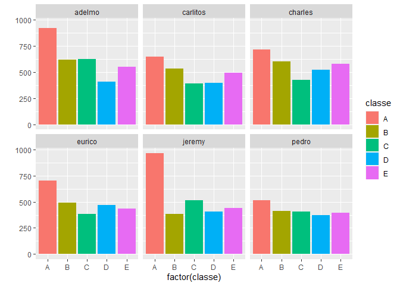

Summary
=======

Devices such as fitbit make it easy to collect data linked to physical
activites, and one thing that is regularly done is to predict the type
of exercise (walking, running,…) according to the the devices’ data.
This time, we won’t do that and focus on the performance rather than the
nature of the activity - in other words, What we’ll do here is not to
predict the “what” but the “how well”.

In this project, six young health participants were asked to perform one
set of 10 repetitions of the Unilateral Dumbbell Biceps Curl in five
different fashions: exactly according to the specification (Class A),
throwing the elbows to the front (Class B), lifting the dumbbell only
halfway (Class C), lowering the dumbbell only halfway (Class D) and
throwing the hips to the front (Class E). Class A corresponds to the
specified execution of the exercise, while the other 4 classes
correspond to common mistakes.

We aim to use train data to build a reliable model to predict whether
the exercise was properly made or not, which means that we want to be
able to predict the class (A to E) according to the measurements given
by the devices

The original data can be found
[here](http://web.archive.org/web/20161224072740/http:/groupware.les.inf.puc-rio.br/har)

Loading the data and packages
=============================

    if (!file.exists("data")) {
       dir.create("data")
    }
    trainUrlFile <- "https://d396qusza40orc.cloudfront.net/predmachlearn/pml-training.csv"
    trainfilename <- "./data/pml-training.csv"

    testUrlFile <- "https://d396qusza40orc.cloudfront.net/predmachlearn/pml-testing.csv"
    testfilename <- "./data/pml-testing.csv"

    if (!file.exists(trainfilename)) {
       download.file(trainUrlFile, trainfilename, method = "curl")
    }

    if (!file.exists(testfilename)) {
       download.file(testUrlFile, testfilename, method = "curl")
    }

    pml_training <- read.csv(trainfilename)
    pml_testing <- read.csv(testfilename)

    library(ggplot2) ; library(caret) ; library(randomForest) ; library(gbm) 
    library(MASS) ; library(nnet) ; library(knitr) ; library(kableExtra)

Data sclicing
=============

Before doing any exploratory data analysis, we will split the training
data into a sub-train and a sub-test dataset :

    set.seed(1234)
    intrain <- createDataPartition(y = pml_training$classe, p = 0.8, list = F)
    subtrain <- pml_training[intrain, ]
    subtest <- pml_training[-intrain, ]

Exploratory data analysis
=========================

We’ll start with a quick histogram showing, for each subject, how well
they globally performed :

    qplot(x = factor(classe), data = subtrain, geom = "bar", fill = classe) + facet_wrap(user_name~ .)

Adelmo, Eurico and Jeremy tend to do the exercise correctly (class A)
more frequently than others. It might be obvious, but this shows that it
is paramount to remove the identifying parameters during the
pre-processing phase or they might be taken as significant variables in
our model fit.

NAs
---

We’ll do a quick check on the NA values of the training set.

Let’s check the dimensions of the subtrain set :

    dim(subtrain)

    ## [1] 15699   160

We have a total of 2511840 cells.

How many of those are NAs ?

    sum(is.na(subtrain))

    ## [1] 1031063

Which means that 41.05% of the cells are NA

We will need to do some pre-processing since we can’t just ignore nearly
half of the data.

Variable classes
----------------

In the dataset, we have numeric, integers and a majority of character
variables.

However, some of the character variables should instead be numeric or
factor. Let’s see that.

Let’s first check the names of all the numeric variables :

    charcols <- numeric()
    for (i in 1:ncol(subtrain)){
       if (class(subtrain[, i]) == "character"){
          charcols <- c(charcols, i)
       }
    }

    names(subtrain)[charcols]

    ##  [1] "user_name"               "cvtd_timestamp"         
    ##  [3] "new_window"              "kurtosis_roll_belt"     
    ##  [5] "kurtosis_picth_belt"     "kurtosis_yaw_belt"      
    ##  [7] "skewness_roll_belt"      "skewness_roll_belt.1"   
    ##  [9] "skewness_yaw_belt"       "max_yaw_belt"           
    ## [11] "min_yaw_belt"            "amplitude_yaw_belt"     
    ## [13] "kurtosis_roll_arm"       "kurtosis_picth_arm"     
    ## [15] "kurtosis_yaw_arm"        "skewness_roll_arm"      
    ## [17] "skewness_pitch_arm"      "skewness_yaw_arm"       
    ## [19] "kurtosis_roll_dumbbell"  "kurtosis_picth_dumbbell"
    ## [21] "kurtosis_yaw_dumbbell"   "skewness_roll_dumbbell" 
    ## [23] "skewness_pitch_dumbbell" "skewness_yaw_dumbbell"  
    ## [25] "max_yaw_dumbbell"        "min_yaw_dumbbell"       
    ## [27] "amplitude_yaw_dumbbell"  "kurtosis_roll_forearm"  
    ## [29] "kurtosis_picth_forearm"  "kurtosis_yaw_forearm"   
    ## [31] "skewness_roll_forearm"   "skewness_pitch_forearm" 
    ## [33] "skewness_yaw_forearm"    "max_yaw_forearm"        
    ## [35] "min_yaw_forearm"         "amplitude_yaw_forearm"  
    ## [37] "classe"

-   user\_name is an ID variable that will be removed
-   cvd\_timestamp should be a date time variable. However, our outcome
    is dependant on the gyroscopic and accelerometric results, not on
    the time they were measured. We can therefore consider this variable
    as an ID variable to remove
-   classe is our outcome. It should be a factor variable
-   new\_window should be a factor variable, but is an ID variable that
    will be removed
-   The rest are measurements that should be numeric instead

Here’s the subset of variables that need to be converted to numeric :

    tonumconv <- charcols[-c(1,2,3,37)]

As for the other variables :

    names(subtrain)[-charcols]

    ##   [1] "X"                        "raw_timestamp_part_1"    
    ##   [3] "raw_timestamp_part_2"     "num_window"              
    ##   [5] "roll_belt"                "pitch_belt"              
    ##   [7] "yaw_belt"                 "total_accel_belt"        
    ##   [9] "max_roll_belt"            "max_picth_belt"          
    ##  [11] "min_roll_belt"            "min_pitch_belt"          
    ##  [13] "amplitude_roll_belt"      "amplitude_pitch_belt"    
    ##  [15] "var_total_accel_belt"     "avg_roll_belt"           
    ##  [17] "stddev_roll_belt"         "var_roll_belt"           
    ##  [19] "avg_pitch_belt"           "stddev_pitch_belt"       
    ##  [21] "var_pitch_belt"           "avg_yaw_belt"            
    ##  [23] "stddev_yaw_belt"          "var_yaw_belt"            
    ##  [25] "gyros_belt_x"             "gyros_belt_y"            
    ##  [27] "gyros_belt_z"             "accel_belt_x"            
    ##  [29] "accel_belt_y"             "accel_belt_z"            
    ##  [31] "magnet_belt_x"            "magnet_belt_y"           
    ##  [33] "magnet_belt_z"            "roll_arm"                
    ##  [35] "pitch_arm"                "yaw_arm"                 
    ##  [37] "total_accel_arm"          "var_accel_arm"           
    ##  [39] "avg_roll_arm"             "stddev_roll_arm"         
    ##  [41] "var_roll_arm"             "avg_pitch_arm"           
    ##  [43] "stddev_pitch_arm"         "var_pitch_arm"           
    ##  [45] "avg_yaw_arm"              "stddev_yaw_arm"          
    ##  [47] "var_yaw_arm"              "gyros_arm_x"             
    ##  [49] "gyros_arm_y"              "gyros_arm_z"             
    ##  [51] "accel_arm_x"              "accel_arm_y"             
    ##  [53] "accel_arm_z"              "magnet_arm_x"            
    ##  [55] "magnet_arm_y"             "magnet_arm_z"            
    ##  [57] "max_roll_arm"             "max_picth_arm"           
    ##  [59] "max_yaw_arm"              "min_roll_arm"            
    ##  [61] "min_pitch_arm"            "min_yaw_arm"             
    ##  [63] "amplitude_roll_arm"       "amplitude_pitch_arm"     
    ##  [65] "amplitude_yaw_arm"        "roll_dumbbell"           
    ##  [67] "pitch_dumbbell"           "yaw_dumbbell"            
    ##  [69] "max_roll_dumbbell"        "max_picth_dumbbell"      
    ##  [71] "min_roll_dumbbell"        "min_pitch_dumbbell"      
    ##  [73] "amplitude_roll_dumbbell"  "amplitude_pitch_dumbbell"
    ##  [75] "total_accel_dumbbell"     "var_accel_dumbbell"      
    ##  [77] "avg_roll_dumbbell"        "stddev_roll_dumbbell"    
    ##  [79] "var_roll_dumbbell"        "avg_pitch_dumbbell"      
    ##  [81] "stddev_pitch_dumbbell"    "var_pitch_dumbbell"      
    ##  [83] "avg_yaw_dumbbell"         "stddev_yaw_dumbbell"     
    ##  [85] "var_yaw_dumbbell"         "gyros_dumbbell_x"        
    ##  [87] "gyros_dumbbell_y"         "gyros_dumbbell_z"        
    ##  [89] "accel_dumbbell_x"         "accel_dumbbell_y"        
    ##  [91] "accel_dumbbell_z"         "magnet_dumbbell_x"       
    ##  [93] "magnet_dumbbell_y"        "magnet_dumbbell_z"       
    ##  [95] "roll_forearm"             "pitch_forearm"           
    ##  [97] "yaw_forearm"              "max_roll_forearm"        
    ##  [99] "max_picth_forearm"        "min_roll_forearm"        
    ## [101] "min_pitch_forearm"        "amplitude_roll_forearm"  
    ## [103] "amplitude_pitch_forearm"  "total_accel_forearm"     
    ## [105] "var_accel_forearm"        "avg_roll_forearm"        
    ## [107] "stddev_roll_forearm"      "var_roll_forearm"        
    ## [109] "avg_pitch_forearm"        "stddev_pitch_forearm"    
    ## [111] "var_pitch_forearm"        "avg_yaw_forearm"         
    ## [113] "stddev_yaw_forearm"       "var_yaw_forearm"         
    ## [115] "gyros_forearm_x"          "gyros_forearm_y"         
    ## [117] "gyros_forearm_z"          "accel_forearm_x"         
    ## [119] "accel_forearm_y"          "accel_forearm_z"         
    ## [121] "magnet_forearm_x"         "magnet_forearm_y"        
    ## [123] "magnet_forearm_z"

-   X and raw\_timestamp are ID variables that will be removed
-   num\_window is also an ID variable. It is also an indicator that can
    completely break this exam. If, for instance, an observation with
    num\_window leads to an “A” measurement of “classe” on the train
    set, it will lead to an “A” class for any other observation with the
    same num\_window value, whether it is in the train or test set.

The subset of ID variable is :

    idvars <- c(1:7)

A quick look to the variables to convert to numeric
---------------------------------------------------

The several variables that we need to convert to numeric contain a lot
of NAs. KNN-Impute algorithms require at least 50% of actual values. If
that requirement is not met, we will simply remove these variables from
the dataset.

    propna <- numeric()
    for (elt in tonumconv){
       k <- sum(is.na(as.numeric(subtrain[, elt])))/nrow(subtrain)
       propna <- c(propna, k)
    }

    quantile(propna)

    ##        0%       25%       50%       75%      100% 
    ## 0.9803172 0.9806357 0.9838206 0.9847761 1.0000000

As we can see, all these variables have at least 98% of missing values.
We can’t use them in any sort of model, so we will delete them during
pre-processing

Pre-Processing
==============

The pre-process will consist in :

1.  Transforming the “classe” outcome in a factor variable
2.  Removing the ID variables
3.  Removing the variables with lots of NAs, as identified in our
    “tonumconv” vector
4.  For the remaining numeric variables, removing those that have more
    than 50% NAs

We combine all these steps into :

-   One function to use on the sub-train frame, that returns a list of
    variables to remove
-   One fuction to use on every data frame, that converts “classe” to
    factor and uses the above-mentionned list to subset the frame

<!-- -->

    preprocsubset <- function(df){
       
       perc_NA <- numeric()
       
       for (i in 1:ncol(df)){
          if (i == ncol(df)){
             p <- 0
          } else {
             p <- sum(is.na(as.numeric(df[, i])))/nrow(df)
          }
          
          perc_NA <- c(perc_NA, p)
       }
       
       toremove <- which(perc_NA > 0.5)
       toremoveall <- unique(c(toremove, idvars, tonumconv))
       
       return(toremoveall)
    }

    preprocesser <- function(df, subsetter){
       
       df[, 160] <- factor(df[, 160])
       
       
       
       df <- df[, -subsetter]
       
       return(df)
    }

We use that preprocess on subtrain :

    ss <- preprocsubset(subtrain)
    subtrain <- preprocesser(subtrain, ss)

Now we can build our model

Model Building
==============

For this study, we will build a random forest algorithm.

To speed things up, we call the parallel and doParallel packages to do
parallel processing.

    library(parallel)
    library(doParallel)
    cluster1 <- makeCluster(detectCores() - 1)
    registerDoParallel(cluster1)

    set.seed(1234)
    modfitrf1 <- randomForest(classe ~ ., data = subtrain)

    stopCluster(cluster1)
    registerDoSEQ()

Let’s check the accuracy of the model on our sub-test set.

We’ll first need to preprocess it :

    subtest <- preprocesser(subtest, ss)

And now we predict the values :

    predrf <- predict(modfitrf1, subtest)

    confusionMatrix(predrf, subtest$classe)$overall["Accuracy"]

    ##  Accuracy 
    ## 0.9936273

We have a very accurate model.

At first, the goal was to build 4 models (a random forest, a GBM, an LDA
and a multinomial GLM) and use majority votes to create a final model
with high accuracy. However, the accuracy of our random forest model is
so high that we do not need the others and we will stop the model
building here.

We’ll go straight to the final testing

Testing
=======

In addition to the training dataset, we were provided a 20-lines long
testing set with the same variables as the training set :

    dim(pml_testing)

    ## [1]  20 160

We’ll first pre-process the testing set in the same way we did for
earlier for the training one :

    testing <- preprocesser(pml_testing, ss)

We now predict the answers using our model and compare the predicted
answers and the real ones that we were provided :

    test_predictions <- predict(modfitrf1, testing)
    confusionMatrix(test_predictions, test_answers)$overall["Accuracy"]

    ## Accuracy 
    ##        1

And we got all 20 answers right !
